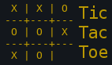
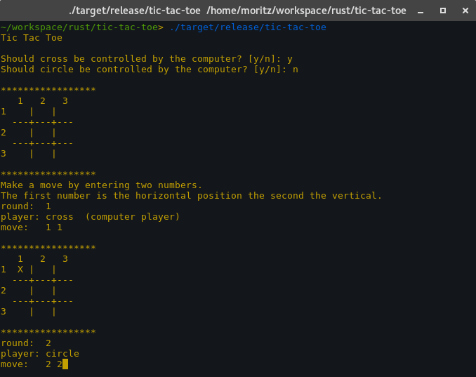

# Tic Tac Toe
Simple CLI based Tic-Tac-Toe game written in [Rust](https://www.rust-lang.org).



# Features
- Two player Multiplayer
- Single player against an (*unbeatable*) AI



## Build instructions

To compile execute:  
(Requires [cargo](https://crates.io))
```sh
cargo build --release
```
The executable will be placed under `./target/release/tic-tac-toe`
